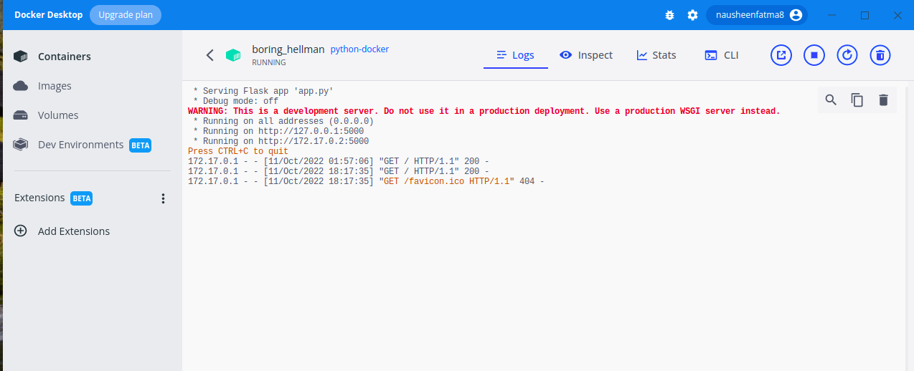
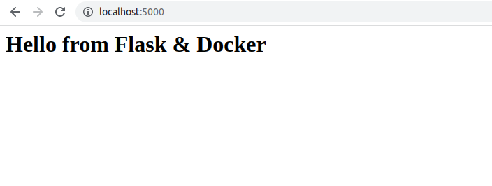

## 1. Install and set up docker and docker desktop

Check my super quick tutorial to set up docker, write and run a simple container here:
https://github.com/nausheenfatma/basic_docker_tutorial

## 2. Build docker image from the dockerfile in this repo.

The following command will build a docker image from the dockerfile

```
docker build --tag python-docker .
```

## 3. Run the container 

```
docker run -d -p 5000:5000 python-docker
```

## 4.  Click the container with label python-docker in docker desktop



## 5. Check on your system web browser localhost


